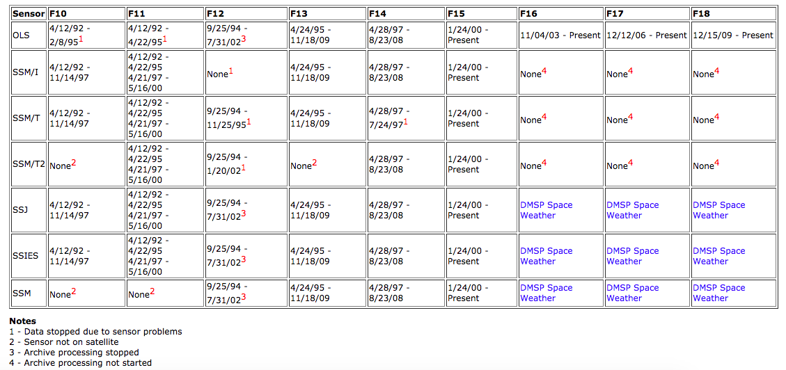
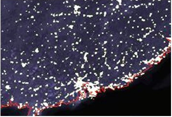
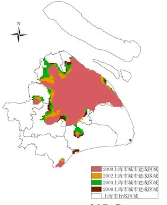
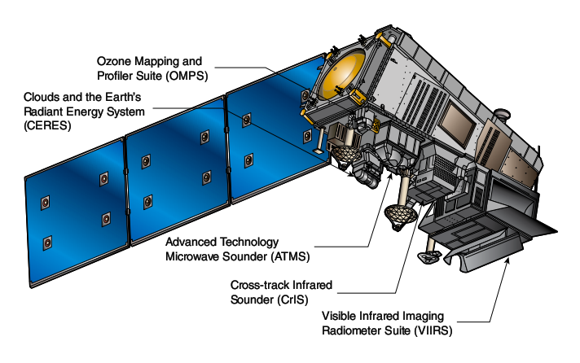
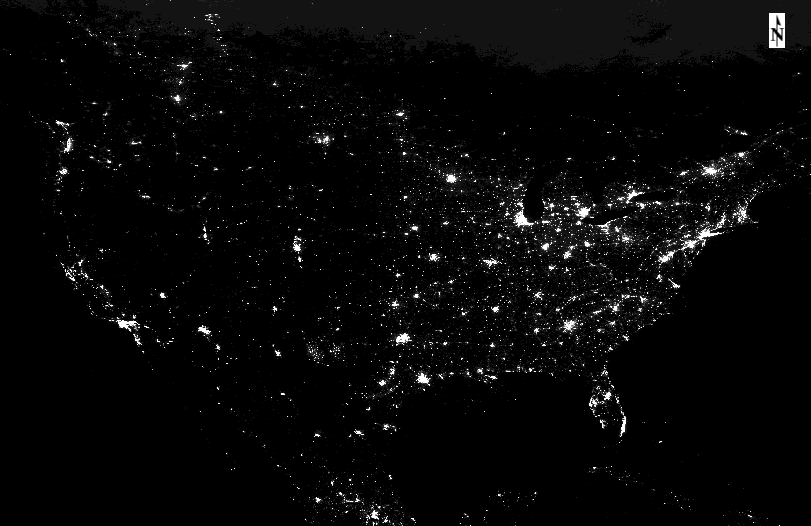

# 
传感器调研报告

&emsp;&emsp;目前，已经有许多传感器具备对地面夜间灯光亮度探测的能力，它们被搭载在诸如DMSP、SuomiNPP、EROS-B、以及中国的吉林一号卫星等。美国军事气象卫星DMSP（Defense Meteorological Satellite Program）是美国国防部的极轨卫星计划（运行高度离地面约830km，与太阳轨道同步，同一钟点每天两次经过地面同一个点），与NOAA卫星属于同一类，不同点在于DMSP星载传感器略有不同。DMSP计划自1965年1月发射第一颗卫星，截止目前为止共发射40多颗卫星。

Data Availability

## DMSP-OLS传感器介绍

&emsp;&emsp;DMSP上的sensors主要包括OLS（Operational Linescan System）、SSM/I（Microwave image）、SSM/T（Atmospheric Temperature Profiler）、SSM/T-2 (Atmospheric Water Vapor Profiler)。

&emsp;&emsp;主要介绍OLS线性扫描系统，它是DMSP最为常用的传感器，OLS传感器能在夜间探测到微弱的电磁波，例如城市灯光、渔船灯火、火灾等光源。OLS传感器主要有两个波段，分别是可见光近红外波段和热红外波段，目前经过NOAA收集整理矫正过的稳定的夜间灯光数据，时间从1992至2013年（年为单位），共34幅图像。34幅稳定夜间灯光数据剔除了云覆盖影响，空间分辨率为30arc-second（大约为1km），像元亮度值范围0-63。

​	OLS夜间灯光数据缺陷主要有两方面：

1. OLS辐射分辨率低。导致城市中心亮度值MAX被限制在63，出现“过饱和”现象。
2. 没有在轨辐射定标。 导致长时间的序列数据之间没有可比性（需要后期处理）。

DMSP DATA

基于DMSP数据提取的城市建成区

## NPP-VIIRS传感器介绍

#### NPP卫星概述

&emsp;&emsp;Suomi NPP卫星是NASA于2011年发射的下一代“极轨卫星系统”（JPSS）的首个运行部分，它是美国目前最为主要的极轨气象卫星，其运行的优先级高于NOAA管理的其他气象预报卫星。JPSS计划成本约为113亿美元，预计到2025年共发射至少4颗卫星，可从极轨提供全球的气象覆盖数据。

&emsp;&emsp;NPP卫星系统主要有5个传感器，主要用来探测地球环境和大气，并且可以追踪大气臭氧和气溶胶以及海洋和陆地表面温度。

NPP卫星结构图

### VIIRS可见光红外成像仪介绍

&emsp;&emsp;VIIRS（Visible Infrared Imaging Radiometer）可见光红外成像仪，主要用来收集大气、陆地、海洋可见光以及红外波段的辐射图像。传感器参数如下：

1. 光谱波段

   | 可见光、近红外 | 短、中波红外 | 热红外 | 低照度可见光波段 |
   | :------------: | :----------: | :----: | :--------------: |
   |      9个       |     8个      |  4个   |       1个        |
   |  0.4～0.9微米  |     1～4     | 8～12  |                  |

2. 分辨率

   - 星下点空间分辨率400m；
   - 扫描带边缘空间分辨率约800m；
   - 幅宽 &plusmn;56&deg;，3000km;
   - 重返周期：每4小时经过赤道一次。

VIIRS 夜间灯光数据
