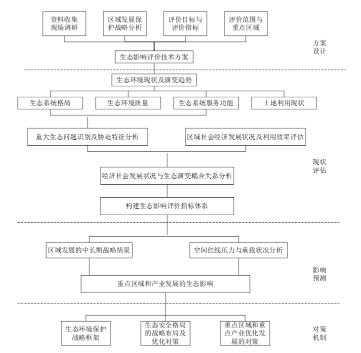

# 
报告书评价与分析

&emsp;&emsp;	本报告书的目标是针对浙江省生态环境状况进行评价，结合浙江省社会经济发展趋势，提出解决区域发展战略与生态安全格局冲突的调整对策，具体到各市区域生态保护优化经济发展的建议，为制订区域发展战略和推动生态文明建设提供决策依据。

&emsp;&emsp;	技术路线主要分为两方面，一是依据生态环境质量现状和演变趋势，识别出重要生态保护空间、关键生态问题和影响因素，再根据多因素的考虑提出不同区域差异性调控。二是分析土地资源开发利用现状与趋势，评价土地资源的承载力，依据承载力评价结果提出调控建议。具体路线图如图一示：

&emsp;&emsp;	报告书首先分析了浙江省生态系统格局现状

>&emsp;&emsp;浙江省生态系统类型以森林、农田、城镇和湿地为主。森林生态系统主要分布在浙西北和浙西南等山地丘陵区;农田生态系 统主要分布在浙北平原、浙东南沿海平原及金衢盆地等地势平坦 区域;城镇生态系统集中在浙北平原、浙东南沿海及浙中丘陵盆 地，呈块状或点状分布;湿地生态系统由内陆广泛分布的河流和 湖泊以及浙东沿海的滩涂沼泽构成;草地生态系统夹杂在林地及其他地类之间，主要由草丛构成;裸地分布较少，由裸岩和裸土构成，零星分布在浙西北山地丘陵区。
>
>&emsp;&emsp;根据土地利用现状变更调查数据，2014 年末全省各类土地总面积 1055.21 万公顷(15828 万亩)，农用地 862.43 万公顷 (12937 万亩)，占土地总面积的 81.7%;建设用地面积(含水库水面 181.3 万亩)126.61 万公顷(1899 万亩)，占土地总面积的12%;未利用地面积 66.17 万公顷(993 万亩)，占土地总面积的 6.3%。   

&emsp;&emsp;随后针对生态系统服务功能进行评价，主要评价内容包括水源涵养功能、生物多样性保护功能、水土保持功能以及综合评价等多项评价指标，最后指出:

> &emsp;&emsp;从浙江省生态系统服务功能的空间分布状况看，多种生态服务功能往往集聚分布在某一区域，其内在联系紧密。生态系统极重要地区主要分布于浙西、浙西南和浙东沿海，其中浙西、浙西南区域的主要生态功能为水源涵养、水土保持及生物多样性维持，多为多种功能聚集的区域，为浙江省绿色屏障；浙东沿海滩涂及近岸海域为生物 多样性维持、水产品提供重要区域，是浙江省的蓝色屏障。 

图一 技术路线图

&emsp;&emsp;	报告第三部分“区域空间管制措施”中分析了浙江省主体功能区规划、省环境功能区划以及生态保护红线。主体功能区规划部分提出规划构建“三带四区两屏”的国土空间开发总格局，建设生态安全体系。 环境功能区划提出了区划目标：

> &emsp;&emsp;区划按照生态环境资源的空间差异性进行环境功能分区，划定生态保护红线，实施分区差别化环境管理政策，约束和引导区域开发布局，控制和改善建设开发活动的环境行为，确保国土开发布局与生态安全格局相协调，对生态环境资源(环境容量)的利用强度控制在生态环境承载力范围之内，为我们子孙后代留足高质量的山、水、林、田、湖等生态空间、优美的生态景观资源 和健康安全的环境质量，实现生态环境资源的永续利用。 

具体体现在：维护生态安全格局、维护人居环境健康、保障农产品环境安全三个方面。

&emsp;&emsp;报告第四部分“经济发展战略布局”。主要结合浙江省国民经济和社会发展第十三个五年 (2016-2020)规划纲要、浙江省现代农业发展“十三五”规划、 浙江省林业发展“十三五”规划、浙江省新型城市化发展“十三五” 规划、浙江省国土资源发展“十三五”规划纲要、浙江省主体功能区规划、浙江省环境功能区划和生态保护红线划分做了分析。对全省未来发展的思路和方向做了分析，对不同地区生态环境功能定位做了阐述。

&emsp;&emsp;报告的最后对环评影响进行总结， 主要出现的问题如下：

- 生态系统质量总体稳定，部分生态系统退化 
- 城镇化趋势明显，建设用地侵占生态用地 
- 空间管控体系不完善 
- 区域发展战略对生态安全造成压力 

&emsp;&emsp;并给出了相应的对策建议：

- 确立生态保护优先战略，切实保护和改善生态环境
- 完善空间管制体系，控制土地开发强度 
- 划定生态保护红线，守住生态保护底线 
- 实施负面清单管理  